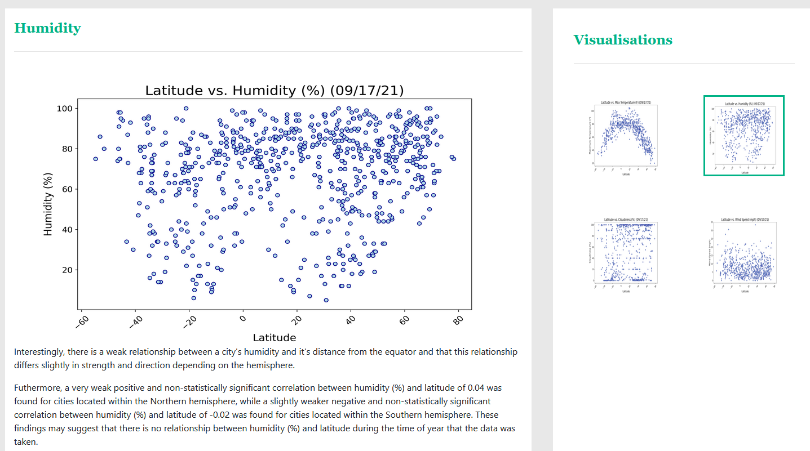

# Weather Analysis Webpage
This is a mobile friendly website which displays data analysis on weather patterns. The purpose of the analysis is see if weather patterns in cities change as they move further away from the equator. It uses a csv file containing a dataset of 672 randomly chosen cities obtained from using the OpenWeatherMap API Friday the 17th of September 2021. The link the repository which created this dataset can be found [here](https://github.com/James-Akerman/python-api-challenge).

The website contains the following pages

#### the homepage/landing page (index.html)

#### the latitude vs cloudiness visualisation page (cloudiness.html)

#### the latitude vs humidity visualisation page (humidity.html)

#### the latitude vs max temperature visualisation (maxtemp.html)

#### the latitude vs wind speed visualisation page (windspeed.html)

#### the html file comparing all four visualisation pages (comparison.html)

#### a table of the data used for this project (data.html)

## Tools/Packages Used
- HTML
- CSS
- Javascript
  - Bootstrap

## How to use
to see the published website please go to https://james-akerman.github.io/weather-analysis-webpage/
